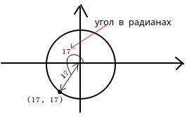
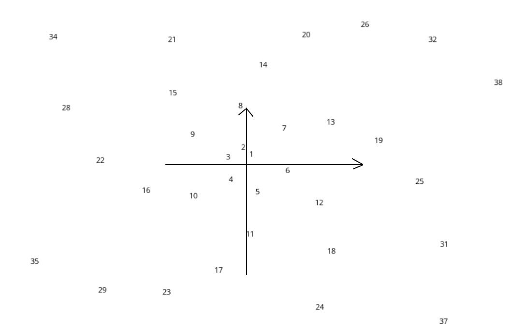

# Что это?

`number_spiralk` - скрипт, который позволит отрисовать "числовые спирали". 

Например, чтобы отрисовать число 17, нужно нанести на координатную сетку координату (17, 17) в **полярной** системе координат.



И так далее...



Оказывается, если "отдалиться", то получаются очень занимательные картинки. Например, для целых чисел рисунок будет выглядить примерно так:


# Запуск

Запускается. например, такой командой:

``` bash
> python number_spiralk.py -w 1920 -h 1080 -max 100000 -scale 10 -o test.png
```

Для вызова текста с пояснениями, что обозначают аргументы, введите:

``` bash
> python number_spiralk.py -help
#или
> python number_spiralk.py -?
```

В директории `./imgsrc/hight/` уже лежат некоторые числовые спирали для простых чисел в разрешении `15000x10000`.

# Добавление своих числовых спиралей

В Директории `custom_row` поменяйте файл `CustomRow.py` так, как вам необходимо. 

В данный момент реализованы:

- Целые числа: `CustomRow_naturalNumbers.py`. 

- Простые числа: `CustomRow_primes.py`. 

- Числа Фибоначчи: `CustomRow_FibonacciNumbers.py`. 